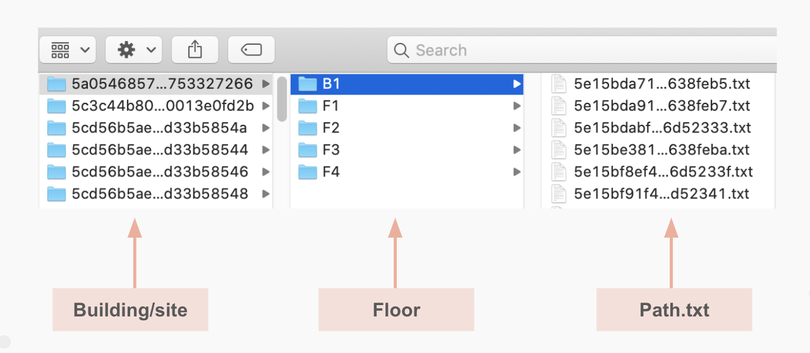
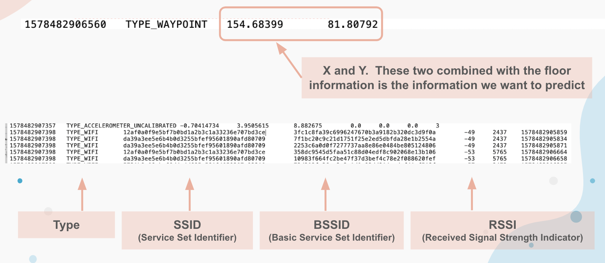
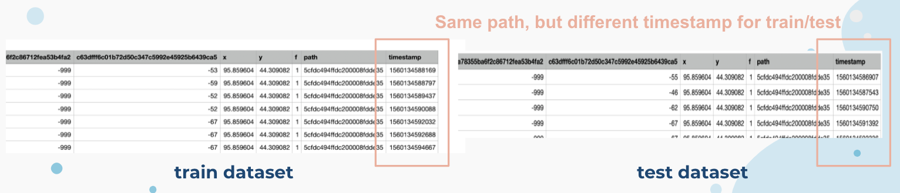
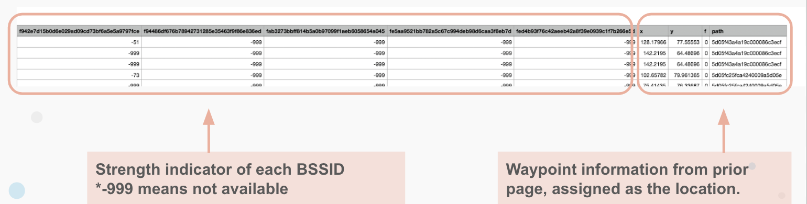
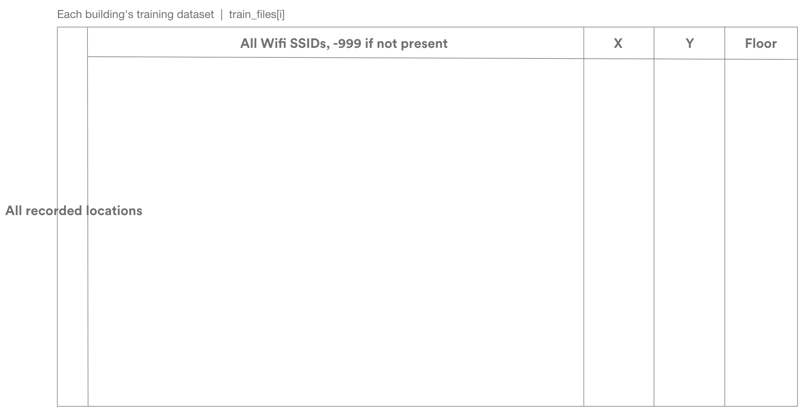
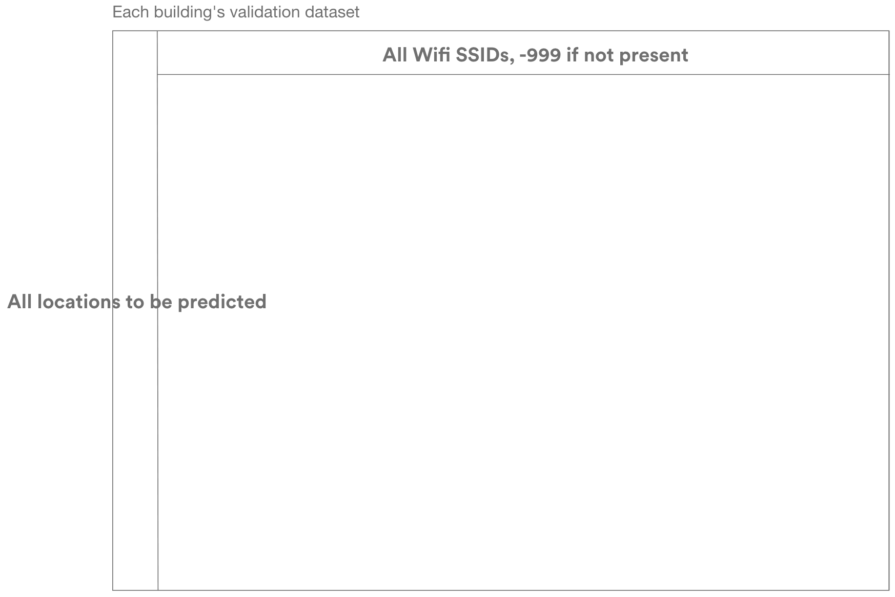

# Menu:
- Project Introduction
- Data Collecting & Cleaning
- Training Environment Setup
- Baseline Model Training
- Training with Unfiltered Dataset
- Training with Filtered Dataset
- Finetuning
- License

# Project Introduction
### InNav Provides Low-Cost Customers Indoor Positioning: Solutions for Smarter Business Strategies and Location-Based Services

Berkeley, CA, Apr 22, 2021 – InNav uses Wifi data to calculate indoor phone locations, which helps both customers navigate in shopping malls, and business owners make smarter business decisions with visualization of customer heatmap. As COVID is being alleviated, people are expecting indoor shopping and indoor activities to return. The company has chosen this time to announce its product, and has been collaborating with business owners to boost their business during the re-openings.

Indoor positioning has always been a challenge in the industry. Power-consuming GPS, inaccurate A-GPS, short-range Bluetooth iBeacon or customized hardware are all far from satisfaction. The drawbacks are obvious:  low-resolution positioning, high power consumption, dependency on additional hardware, and privacy worries. InNav chooses Wifi signals to predict user location that has advantages of high accuracy, low power consumption, and no requirement for additional hardware setup. InNav asks for users’ permission to collect WiFi information, and the service is built upon existing shopping mall WiFi infrastructure with nothing charged to users. Small business owners may choose to have paid subscriptions to receive analysis of customer heatmap and recommendation of store locations.

The wifi positioning + business decision is a solution proven in need by businesses and is a business model with a closed loop. 

There exist solutions like using camera + face detection to calculate customer numbers, but was strictly restricted due to privacy concerns. InNav solution requires no user data to analyze customer heatmap and fully respects people’s privacy, which gives InNav a chance to break into the market.

‘The innovation of InNav is a combination of cutting-edge machine learning algorithm that achieved nearly the best location positioning in the industry, and a novel business model that solves the challenge of the data source.’ said Xiaobai, the Chief Product Officer of InNav, ‘InNav empowers small business with the ability to get a better understanding of customers, what they like, where they linger, how they react.’ Based on customer route visualization, business owners have an intuitive understanding of the current business welcomeness to empower decision making from rearranging counters to adjusting decoration/banners to attract more customers, and have the ability to instantly see feedback on InNav, which is something that can only be estimated by bare eyes in the past.

### About Us
InNav is a startup founded with love and professional skills in Berkeley by Shengfeng Li, Peng Xu, Xiaobai Ji, Mei Chun Yeh, and Jiayue Tao. The interdisciplinary team is formed by designers, data scientists, and full-stack developers. The team’s vision is to use big data to empower retails with smarter business decisions. The team is actively looking for investments and capital to support the next stage collaboration with shopping malls and businesses.

# Data Collecting & Cleaning
### Original Dataset Structure
The original dataset is close to 70 GB.  As shown in the screenshot below, each file corresponds to one site (building). Within each building, there are several files on the second layer, corresponding to certain floors.  The next level of the folder contains a txt file detailing the path.

In the path file, there are lots of information, including the type of the data.  We are primarily looking at type indicating 'wifi' and 'waypoint'.

The structure of data that contains information related to waypoint and wifi is presented below.

### Dataset Cleaning, and splitting of training/testing
The code iterates through each path txt file based on the site that the path belongs to.  For each site, we first retrieve all the timestamps that wifi records have, and select 75% of them as the training set and remaining 25% as the testing set.

Among the training set, we look at how many times a wifi occurs, and select the ones appearing more than 500 times as the benchmark.  Next, based on each timestamp, we pivot the wifi data so that all the wifi at one time all appear into one row.  Having -999 means at that specific time, that specific wifi is not detected.  We do the similar thing for testing data.

### Assigining the x,y, and floor
We are interested in the waypoint location at certain time. With wifi's timestamp, we iterate through the waypoint and pick the waypoint that is closest to the wifi using waypoint's timestamp. As a result, the location can be appended.

Original dataset: https://drive.google.com/drive/folders/1lBWdS7o7d75u9YKNUvgxzcQ0xUUB_r5g?usp=sharing

Processed dataset: https://berkeley.box.com/v/InNav-dataset

Calculation result: https://berkeley.box.com/v/InNav-dataset-result

# Training Environment Setup
It is estimated that training on GPU is need. Thus, we have selected Colab Pro as our training environment, including accessing Google Drive as storages, 2 CPU cores,  NVIDIA V100/P100 as GPU, and 32G RAM. Some codes are used for mounting Google Drive as hard drives, and installing dependencies and libraries on Colab environment.
> For more information regarding Colab, please visit https://colab.research.google.com/notebooks/intro.ipynb

When you mount Google Drive as a local hard drive:
> from google.colab import drive
> 
> drive.mount('/content/drive')

When you copy the dataset from Googel Drive:
> !cp /content/drive/MyDrive/Data-x/data/filtered/*.csv /content/data/

Using this command, filtered data was copied to /content/data/. If you would like to run on your Colab/your local environment, please modify this line in order to guarantee dataset is loaded successfully (make sure in subsequent codes, variable train_files and test_files can correctly capture the filenames of the datasets)

# Baseline Model Training
In order to test out how baseline machine learning models perform on our current dataset, we selected Ridge Regression and Lasso Regression as the baseline model.
The code is in the file /Data_X_inNav_wifi_data_Baseline_with_filtered_data.ipynb

The file was composed of 3 sections. In the first section, training datasets and testing datasets generated from previous steps are loaded from Google Drive, and the filenames are stored in variable train_files and test_files. Then, in the section **Baseline 1: Ridge Regression** we train with Ridge Regression, and in the section **Baseline 2** we train with Lasso Regression. The result was shown below.

# Training with Unfiltered Dataset
### Model Selection
We have chosen LightGBM because LightGBM is a tree-based gradient boosting framework with high efficiency and great performance on large datasets, and fully supports parallel and GPU training.
### Training with LightGBM
The code is in the file /Data_X_inNav_wifi_data_unfiltered_data_fineTune.ipynb
In the first section, LightGBM that supports GPU is installed, and the unfiltered dataset is loaded from Google Drive. Then, we define 3 models that fits X, Y and Floor. Performance was measured with MSE.

KFold is also used. Folds = 10

> For more information regarding LightGBM, please visit https://github.com/microsoft/LightGBM

### Performance
Performance was measured with MSE
# Training with Filtered Dataset
### Why do we filtered the dataset
Based on previous methodology, one waypoint may be corresponding to multiple wifi.  We are thinking maybe this gives extra information.  Therefore, on top of the existing data, we use the timestamp for waypoint as the base, and find the wifi that is closest to the waypoint.  Doing the same thing for both training and testing set, we get filtered dataset for both.

### Training with LightGBM on Filtered Data
The code is in the file /Data_X_inNav_wifi_data_filtered_data.ipynb
In the first section, LightGBM that supports GPU is installed, and the unfiltered dataset is loaded from Google Drive. Then, we define 3 models that fits X, Y and Floor. Performance was measured with MSE

# Finetuning
### LightGBM Hyperparameters

The image shows the parameters for the LightGBM model. Because the X and Y model is quite different from the Floor model, we used two pairs of parameters. During the finetuning, we discovered that the overall testset MSE is most sensitive to reg_alpha. We didn't put much focus on tuning other parameters like num_leaves due to the fact that although we have selected the number we believe performs the best, adjusting it didn'g increase/decrease testset MSE significantly.
# License
This project is under AGPL-3.0 License 
