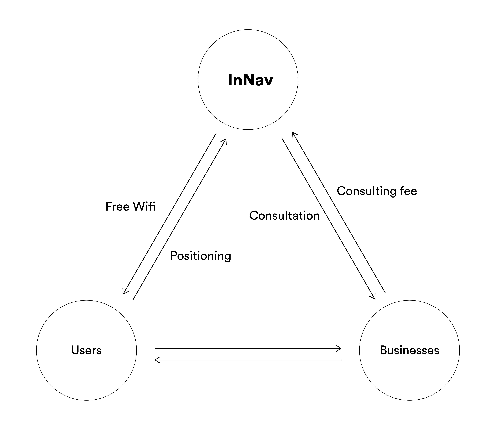
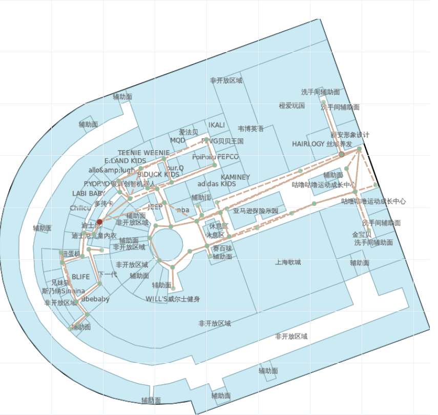

# InNav Provides Low-Cost Customers Indoor Positioning: Solutions for Smarter Business Strategies and Location-Based Services

Berkeley, CA, Apr 22, 2021 – InNav uses Wifi data to calculate indoor phone locations, which helps both customers navigate in shopping malls, and business owners make smarter business decisions with visualization of customer heatmap. As COVID is being alleviated, people are expecting indoor shopping and indoor activities to return. The company has chosen this time to announce its product, and has been collaborating with business owners to boost their business during the re-openings.

Indoor positioning has always been a challenge in the industry. Power-consuming GPS, inaccurate A-GPS, short-range Bluetooth iBeacon or customized hardware are all far from satisfaction. The drawbacks are obvious:  low-resolution positioning, high power consumption, dependency on additional hardware, and privacy worries. InNav chooses Wifi signals to predict user location that has advantages of high accuracy, low power consumption, and no requirement for additional hardware setup. InNav asks for users’ permission to collect WiFi information, and the service is built upon existing shopping mall WiFi infrastructure with nothing charged to users. Small business owners may choose to have paid subscriptions to receive analysis of customer heatmap and recommendation of store locations.

The wifi positioning + business decision is a solution proven in need by businesses and is a business model with a closed loop. 

There exist solutions like using camera + face detection to calculate customer numbers, but was strictly restricted due to privacy concerns. InNav solution requires no user data to analyze customer heatmap and fully respects people’s privacy, which gives InNav a chance to break into the market.

‘The innovation of InNav is a combination of cutting-edge machine learning algorithm that achieved nearly the best location positioning in the industry, and a novel business model that solves the challenge of the data source.’ said Xiaobai, the Chief Product Officer of InNav, ‘InNav empowers small business with the ability to get a better understanding of customers, what they like, where they linger, how they react.’ Based on customer route visualization, business owners have an intuitive understanding of the current business welcomeness to empower decision making from rearranging counters to adjusting decoration/banners to attract more customers, and have the ability to instantly see feedback on InNav, which is something that can only be estimated by bare eyes in the past.

## About Us
InNav is a startup founded with love and professional skills in Berkeley by Shengfeng Li, Peng Xu, Xiaobai Ji, Mei Chun Yeh, and Jiayue Tao. The interdisciplinary team is formed by designers, data scientists, and full-stack developers. The team’s vision is to use big data to empower retails with smarter business decisions. The team is actively looking for investments and capital to support the next stage collaboration with shopping malls and businesses.

## Press Contact
Peng Xu
Xiaobai Ji

## Dataset
Original dataset: [to be filled in]

Processed dataset: https://berkeley.box.com/v/InNav-dataset

Calculation result: https://berkeley.box.com/v/InNav-dataset-result

https://innav.ml
